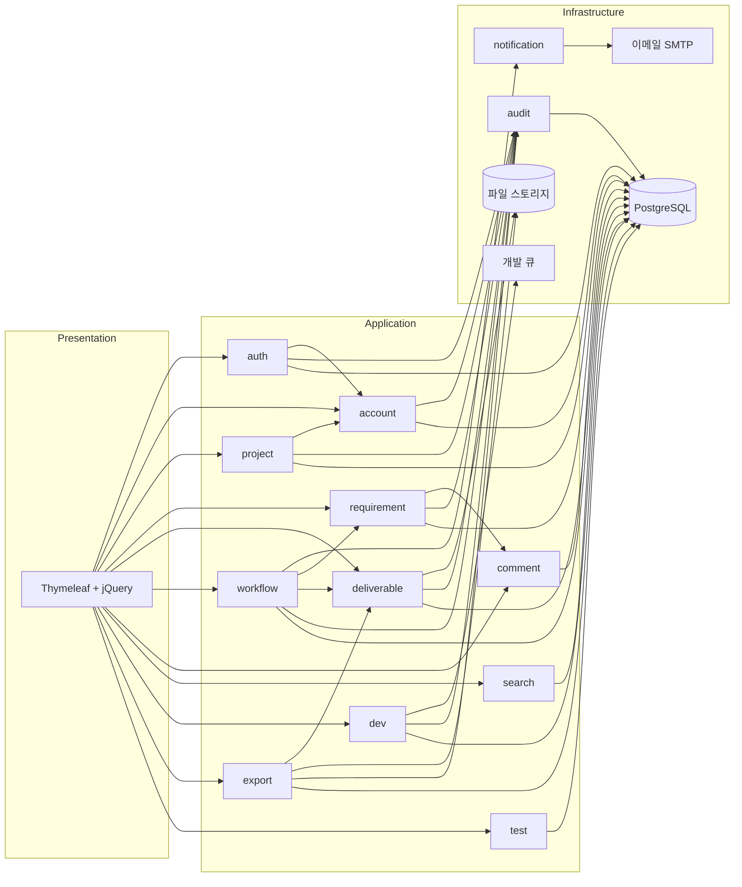

# 아키텍처 설계서

| 항목 | 내용 |
|------|------|
| 프로젝트명 | SoftPuzzle PM |
| 작성일 | 2026-05-19 |
| 버전 | v0.2 (MVP pivot 반영) |
| 관련 단계 | 10~17 (설계 전반, 시안 진입 전 작성 권장) |
| 관련 산출물 | `deliverables.md` No.5 |
| 입력 문서 | `requirements.md` v1.1, `ia.md` v0.2 |
| 분리 산출물 | 물리 인프라 구성은 `infrastructure.md` (No.6) 참조 |

> 본 문서는 **논리 아키텍처·배포 구조·보안 설계**를 다룬다. 물리적 서버·DB·네트워크 구성은 별도 산출물(No.6).

---

## 1. 논리 아키텍처

### 1-1. 기술 스택

| 영역 | 채택 기술 | 사유 |
|------|----------|------|
| 언어·런타임 | Java 17 LTS | Spring Boot 3.x 최소 요구 |
| 프레임워크 | Spring Boot 3.x | REQ-DEV-001 출력 표준 스택 |
| 영속성 | MyBatis 3.x | REQ-DEV-001 출력 표준, XML Mapper 기반 |
| DB | PostgreSQL 15+ | REQ-DEV-001 출력 표준 |
| 보안 | Spring Security 6.x (세션 기반) | REQ-NFR-001 |
| 뷰 | Thymeleaf + jQuery | SSR, 글로벌 컨벤션 정합 |
| 빌드 | Gradle (Wrapper 포함) | 글로벌 컨벤션 |
| DB 마이그레이션 | Flyway | 글로벌 컨벤션 (schema.sql 직접 관리 금지) |
| 테스트 DB | Testcontainers + PostgreSQL | 글로벌 컨벤션 (H2 금지) |
| 마이그레이션 위치 | `resources/db/migration/V{n}__{desc}.sql` | 글로벌 컨벤션 |

### 1-2. 레이어 구조

```
┌──────────────────────────────────────────────────┐
│  Presentation Layer                              │
│  · Thymeleaf View · jQuery                       │
│  · *Controller (요청 처리·라우팅)                  │
│  · *Request/*Response (DTO)                      │
├──────────────────────────────────────────────────┤
│  Application Layer                               │
│  · *Service (트랜잭션 경계, 유스케이스 조립)        │
│  · @Transactional 명시 (읽기 전용 readOnly=true)   │
├──────────────────────────────────────────────────┤
│  Domain Layer                                    │
│  · Entity, Value Object                          │
│  · Domain Service (도메인 규칙)                   │
│  · 커스텀 RuntimeException                        │
├──────────────────────────────────────────────────┤
│  Infrastructure Layer                            │
│  · *Mapper (MyBatis, XML)                        │
│  · External Adapter (이메일 발송, 개발 호출,    │
│    스토리지, 감사 로그 등)                         │
└──────────────────────────────────────────────────┘
```

> 글로벌 컨벤션: `Map<String, Object>` 금지, Mapper 반환/파라미터는 엔티티·DTO만.  
> 와일드카드 import 금지. RuntimeException 기반 커스텀 예외.

### 1-3. 컴포넌트 구성

| 컴포넌트 | 책임 | 주요 의존 |
|----------|------|----------|
| **auth** | 인증·세션·비밀번호·초대 토큰·계정 잠금 | REQ-AUT-001~012 |
| **account** | 관리자/프로젝트팀/고객사 계정 CRUD, 비활성화·익명화 | REQ-AUT-004, REQ-AUT-006, REQ-NFR-005 |
| **project** | 프로젝트 생성·조회·삭제(소프트), 멤버십 | REQ-PRJ-001~003 |
| **requirement** | 요구사항 파일 메타 관리(업로드·버전·컨펌). MVP pivot(v2.0)으로 항목별 CRUD 폐기. 파일 본체는 `deliverable` 컴포넌트와 공유. | REQ-REQ-001~003, REQ-FILE-001~002 |
| **deliverable** | 산출물 슬롯·버전 관리, 파일 업/다운로드 | REQ-DSN-001~004, REQ-FILE-001~002 |
| **workflow** | 검토 요청·컨펌·반려·게이트 잠금, 이력 | REQ-WF-001~004, REQ-CMT-002 |
| **notification** | 이메일 발송 어댑터 | REQ-NTF-001 |
| **comment** | 단계별·항목별 코멘트 (요구사항·산출물 공통) | REQ-CMT-001 |
| **search** | 통합 검색 (요구사항·코멘트·파일명·이력) | REQ-SCH-001 |
| **audit** | 감사 로그 자동 기록·조회 (변조 불가) | REQ-AUD-001 |
| **dev** | 개발 큐 등록·진행 상태·결과 수신 | REQ-DEV-001 |
| **export** | 산출물 일괄/선택 Export (PDF·ZIP) | REQ-DEV-002 |
| **test** | TC 목록·결함 추적 | REQ-TST-001~003 |

### 1-4. 컴포넌트 의존 다이어그램



> 모든 도메인 컴포넌트는 `audit`로 변경 이벤트 송출 (REQ-AUD-001).  
> `notification`은 `workflow`·`auth`·`account` 이벤트를 구독해 이메일 발송.

---

## 2. 배포 구조

### 2-1. 환경 분리

| 환경 | 목적 | 데이터 |
|------|------|--------|
| **local** | 개발자 로컬 | Testcontainers DB |
| **dev** | 통합 개발 | 더미 데이터, 자유 초기화 |
| **staging** | 운영 직전 검증·UAT | 운영 데이터 마스킹 사본 |
| **prod** | 실 운영 | 실데이터, 백업 정책 적용 |

### 2-2. 배포 흐름

```
[로컬 개발] ─push→ [Git 저장소]
                       │
                       ├─ CI: 빌드 + 테스트 (Gradle + Testcontainers)
                       │   └─ 실패 시 머지 차단
                       │
                       ├─ CD: dev 자동 배포 (main 브랜치)
                       │
                       ├─ CD: staging 배포 (release 태그)
                       │   └─ UAT (16~17단계)
                       │
                       └─ CD: prod 배포 (release 승인 후)
                           └─ 무중단 배포 (Blue-Green 또는 Rolling)
```

### 2-3. 파이프라인 단계

| 단계 | 작업 | 차단 조건 |
|------|------|----------|
| Build | Gradle clean build | 컴파일·테스트 실패 |
| Static Analysis | Checkstyle / SpotBugs (선택) | 치명 위반 |
| Test | 단위 + 통합 (Testcontainers) | 실패 |
| Migration Dry-run | Flyway info | 스크립트 오류 |
| Deploy | dev → staging → prod 순차 | 이전 환경 헬스체크 실패 |
| Smoke Test | 핵심 엔드포인트 health check | 5xx, 응답 시간 초과 |

> 실제 파이프라인 구현(GitHub Actions vs Jenkins 등)은 No.20 배포 가이드에서 확정.

---

## 3. 보안 설계

### 3-1. 인증

| 항목 | 정책 | 근거 |
|------|------|------|
| 인증 방식 | Spring Security 세션 기반 | REQ-NFR-001 |
| 비밀번호 해시 | BCrypt (cost 12) | 업계 표준 |
| 비밀번호 정책 | 최소 8자, 영문·숫자·특수문자 각 1자 이상, 직전 3개 재사용 금지 | REQ-AUT-010 |
| 로그인 실패 잠금 | 5회 연속 실패 → 10분 잠금 | REQ-AUT-007 |
| 세션 타임아웃 | 30분 무활동 시 만료 | REQ-AUT-009 |
| 세션 저장소 | 서버 사이드 (DB 또는 Redis — 운영 시 결정) | — |
| HTTPS | 운영 환경 필수 | REQ-NFR-001 |
| 토큰 (초대·비번 재설정) | 1회용, 만료 즉시 무효화 | REQ-AUT-002~003, REQ-AUT-011~012 |
| 진입 라우팅 | URL 기반: 일반 `/login` vs `/login?redirect=/projects/{id}` | REQ-AUT-007 |

### 3-2. 인가

| 항목 | 정책 |
|------|------|
| 권한 모델 | 3-tier (관리자 / 프로젝트팀 / 고객사). MVP에서 RBAC 미적용. |
| 권한 정의 | `requirements.md` §3 권한 매트릭스 단일 진실의 원천 |
| 권한 위반 응답 | HTTP 403 (REQ-NFR-001) |
| 비로그인 보호 페이지 접근 | `/login?redirect=...` 리다이렉트 |
| 프로젝트 멤버십 검증 | `🔵` 권한 항목은 프로젝트 멤버십 확인 후 허용 |
| 인가 구현 위치 | Spring Security 필터 + 컨트롤러 어드바이스 + 서비스 레이어 가드 (defense in depth) |

### 3-3. 데이터 보호

| 항목 | 정책 | 근거 |
|------|------|------|
| 데이터 삭제 | 소프트 삭제 기본. 프로젝트 삭제 시 30일 복구 가능 후 영구 삭제 | REQ-NFR-005 |
| 산출물 파일 보존 | 프로젝트 종료 후 1년 | REQ-NFR-005 |
| 감사 로그 보존 | 1년, 변조·삭제 불가 (append-only) | REQ-AUD-001, REQ-NFR-005 |
| 계정 비활성화 | 1년 후 개인정보(이름·이메일) 자동 익명화, 활동 이력 보존 | REQ-NFR-005 |
| 이력 추적 | 요구사항·산출물 변경 시 누가·언제·무엇 기록 | REQ-REQ-002, REQ-AUD-001 |
| 시크릿 관리 | JWT secret·DB 비밀번호 등은 환경변수 필수. 기본값 하드코딩 금지 | 글로벌 컨벤션 |

### 3-4. HTTP 보안 헤더

| 헤더 | 정책 | 근거 |
|------|------|------|
| CSRF 토큰 | 상태 변경 요청(POST/PATCH/DELETE)에 필수. `<meta>` 토큰 + `$.ajaxSetup`으로 비-GET 자동 첨부 | 상태 변경 보호 |
| `X-Frame-Options` | `SAMEORIGIN` — 동일 출처 iframe 허용(산출물 **PDF 미리보기** 임베드). `DENY`이면 미리보기 차단됨 | 산출물 미리보기 |
| `Cache-Control` (정적 JS) | `no-store` — 배포 후 구버전 스크립트 캐시 방지 | 배포 일관성 |

### 3-5. 감사 로그 (REQ-AUD-001)

기록 대상:
- 로그인·로그아웃·로그인 실패
- 계정 생성·수정·비활성화, 비밀번호 변경·재설정
- 요구사항·산출물 파일 생성·수정·삭제
- 컨펌·반려·게이트 통과
- 개발 시작·완료·실패
- 산출물 Export

기록 필드: 일시(UTC), 사용자 ID, 역할, 액션 타입, 대상 객체 ID, 변경 전/후(해당 시), IP 주소.  
조회 권한: 관리자만. 기간·사용자·액션 필터. 변조 방지(append-only).

---

## 4. 횡단 관심사

### 4-1. 로깅 (Slf4j, 글로벌 컨벤션)

- Controller 진입: `log.info("[HTTP메서드 /경로] param={}", value)`
- Service 진입·완료: `log.info("[메서드명] key={}", value)`
- catch 블록: `log.error("[메서드명] 실패", e)` — 스택트레이스 포함 필수
- 중요 분기점: `log.debug` — if/else 분기 추적

### 4-2. 예외 처리

- 도메인별 커스텀 RuntimeException
- 글로벌 `@RestControllerAdvice` / `@ControllerAdvice`로 일관된 응답
- API 응답 형식: `{ "success": true, "data": {...} }` 또는 `{ "success": false, "message": "..." }`
- HTTP 상태: 200(성공) / 400(잘못된 요청) / 403(권한 없음) / 404(없음) / 500(서버 에러)

### 4-3. 트랜잭션

- 서비스 계층에 `@Transactional` 명시
- 읽기 전용은 `readOnly = true`
- 외부 호출(이메일·개발 큐) 포함 시 **트랜잭션 외부**에서 발행 (이벤트 발행 패턴)

### 4-4. 비동기 처리

- 개발(REQ-DEV-001): 비동기 큐 등록, 백그라운드 워커가 처리
- 이메일 알림(REQ-NTF-001): 이벤트 큐 기반 비동기 발송 (트랜잭션 분리)
- 진행 상태 폴링 또는 SSE — MVP는 폴링 권장 (구현 단순화)

### 4-5. 검색 (REQ-SCH-001)

- 부분 일치 LIKE 기반 (MVP)
- DB 인덱스: 요구사항 제목·설명, 코멘트 본문, 파일명, 워크플로우 이력 액션·코멘트
- 응답 1초 이내 (REQ-NFR-002와 정합)
- 결과는 권한 매트릭스 필터링 적용

---

## 5. 비기능 요구사항 매핑

| NFR | 적용 위치 |
|-----|----------|
| REQ-NFR-001 보안 | §3 보안 설계 |
| REQ-NFR-002 성능 (페이지 3초/API 1초) | §4-5 검색 인덱스, §1-1 기술 스택 선택 |
| REQ-NFR-003 브라우저 (Chrome·Edge 최근 2 메이저) | §1-1 SSR + jQuery 선택 |
| REQ-NFR-004 반응형 (데스크탑 1280px+) | 디자인 시안·CSS 단계 적용 |
| REQ-NFR-005 데이터 정책 | §3-3 데이터 보호 |

---

## 6. 결정 사항·전제

| 항목 | 결정 | 사유 |
|------|------|------|
| SSR 채택 | Thymeleaf + jQuery (SPA 아님) | 글로벌 컨벤션 정합, MVP 단순화, REQ-DEV-001 출력 스택과 일관 |
| 세션 기반 인증 | JWT 아님 | Spring Security 표준 패턴, SSR 정합, 세션 무효화 명시 가능(REQ-AUT-008) |
| 비동기 진행 표시 | 폴링 채택 (MVP) | SSE보다 구현 단순, REQ-NFR-002 1초 응답 만족 |
| 이메일만 알림 | 인앱 알림 없음 | 9회차 루프에서 결정 (요구사항 협의) |
| RBAC 미적용 | 3-tier 고정 | MVP 범위, REQ-AUT-001 |
| Flyway 채택 | schema.sql 직접 관리 안 함 | 글로벌 컨벤션 |
| Testcontainers 채택 | H2 사용 안 함 | 글로벌 컨벤션 (DB별 문법 차이 회피) |

---

## 변경 이력

| 버전 | 날짜 | 내용 |
|------|------|------|
| v0.1 | 2026-05-19 | 초안 작성 (논리 아키텍처·배포 구조·보안 설계·횡단 관심사·NFR 매핑·결정 사항) |
| v0.2 | 2026-05-19 | MVP pivot 반영: `requirement` 컴포넌트 책임 축소 — 항목별 CRUD 폐기, 파일 메타 관리만 유지 (`deliverable`과 파일 본체 공유) |
