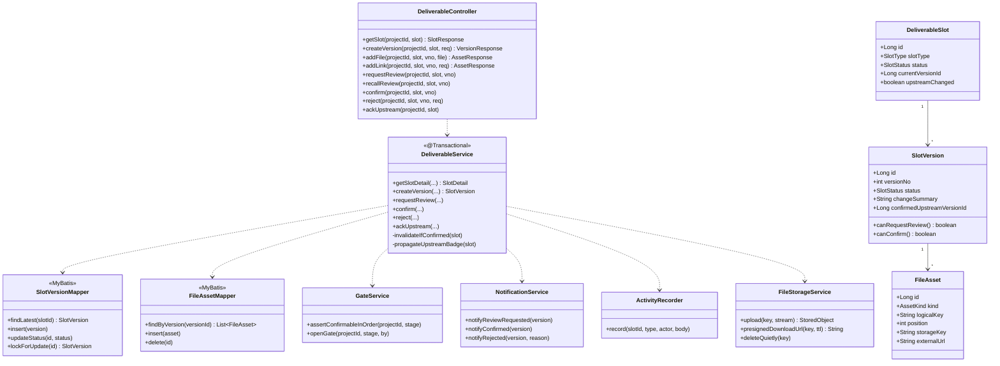
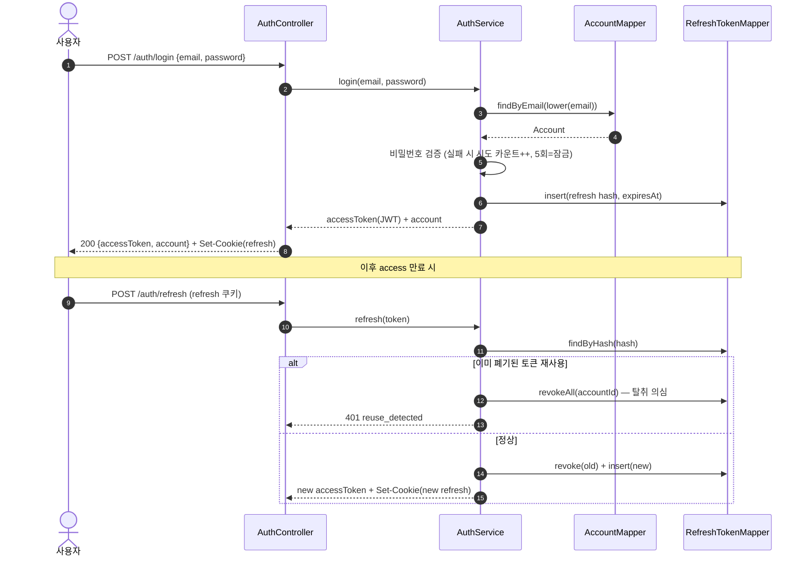
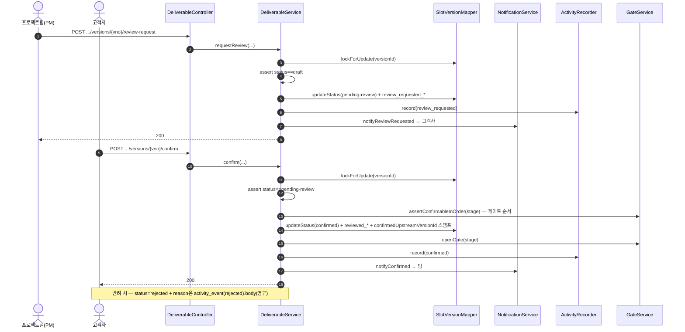
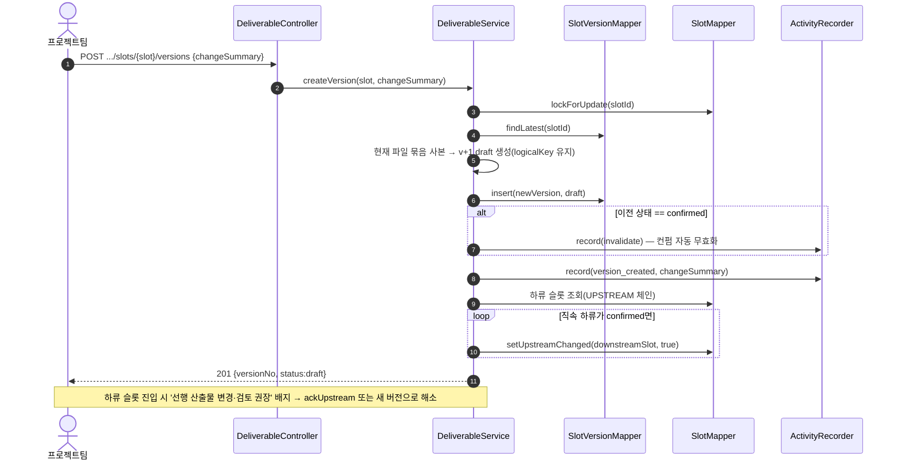
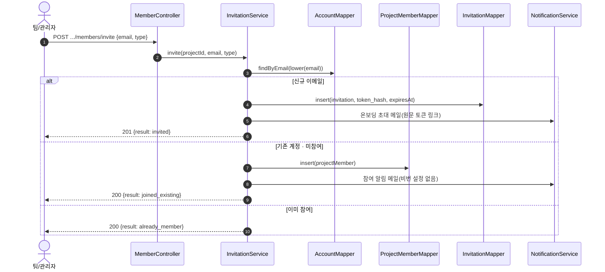
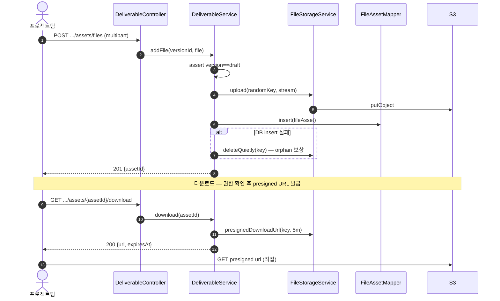

# 클래스 · 시퀀스 다이어그램

| 항목 | 내용 |
|------|------|
| 프로젝트명 | SoftPuzzle PM |
| 버전 | v0.1 (초안 — 계층 구조 + 핵심 워크플로우 흐름) |
| 작성일 | 2026-05-21 |
| 기준 | ERD(`erd.md` v1.2) · API 명세서(`api-spec.md` v0.3) · 화면 설계서 |
| 스택 | Spring Boot · MyBatis · PostgreSQL · JWT · S3 |
| 관련 단계 | 17~18 (선택 산출물 — 객체 구조·처리 흐름 명세) |

> 산출물 No.13(선택). ERD/API와 같은 Mermaid 마크다운. **전 도메인을 다 그리지 않고**, 가장 복잡한 **산출물 슬롯 워크플로우**를 대표로 계층 구조를 보이고, 핵심 흐름만 시퀀스로 명세한다. 다른 도메인(TC·결함·계정 등)도 동일한 `Controller → Service → Mapper` 계층을 따른다.

---

## 1. 계층 아키텍처 — 클래스 다이어그램 (대표: 산출물 도메인)

> 얇은 Controller(검증·DTO 변환) → 트랜잭션 경계 Service(비즈니스 규칙) → MyBatis Mapper(SQL). 횡단 관심사(인증·알림·활동기록·파일저장)는 별도 컴포넌트로 분리.

> 공통: 모든 Controller는 `@RestController` + `ApiResponse<T>` 봉투, 예외는 `@RestControllerAdvice`가 `{success:false, code, message}`로 변환. Service는 `@Transactional`(읽기는 `readOnly=true`). 인증은 `JwtAuthFilter` → `SecurityContext`. 동시성 민감 동작은 `SlotVersionMapper.lockForUpdate`(SELECT … FOR UPDATE, api-spec §14).

---

## 2. 시퀀스 다이어그램

### 2-1. 로그인 · 토큰 회전

### 2-2. 검토 요청 → 컨펌 / 반려 (게이트 해제)

### 2-3. 새 버전 만들기 (컨펌 무효화 + 선행 배지 전파, REQ-WF-005)

### 2-4. 멤버 초대 (스마트 분기 — 신규 / 기존)

### 2-5. 파일 업로드(S3) · presigned 다운로드

---

## 3. 노트

- **계층 일관성**: TC·결함·프로젝트·계정 등 다른 도메인도 `Controller → Service(@Transactional) → Mapper` 동일 패턴. 본 문서는 가장 복잡한 산출물 워크플로우만 대표로 명세.
- **트랜잭션·동시성**: 상태 전이(검토 요청/회수/컨펌/반려/새 버전)는 `SELECT … FOR UPDATE`로 직렬화 (api-spec §14, ERD 부분 유니크 보완).
- **반려 사유**·**활동 이력**: `activity_event`(append-only)에 기록, 코멘트와 분리(REQ-WF-004/CMT-002).
- **보안**: refresh 회전·재사용 탐지, 초대/토큰 해시 저장, presigned 단명 URL — ERD·api-spec과 동일.
- **미작성(후속 필요 시)**: 개발 트리거(dev_run) 사전조건 검증 시퀀스, 검색 인덱싱, 알림 fan-out 상세.
