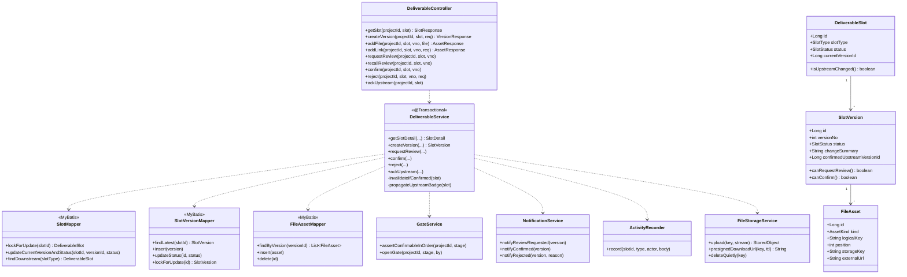
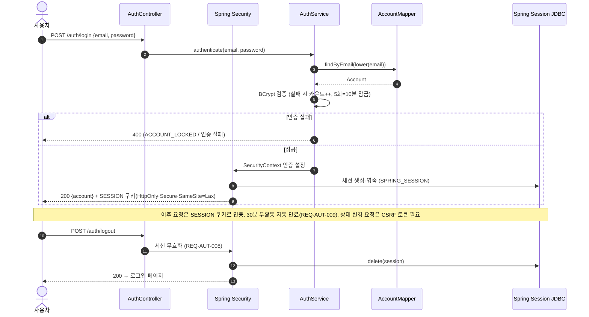
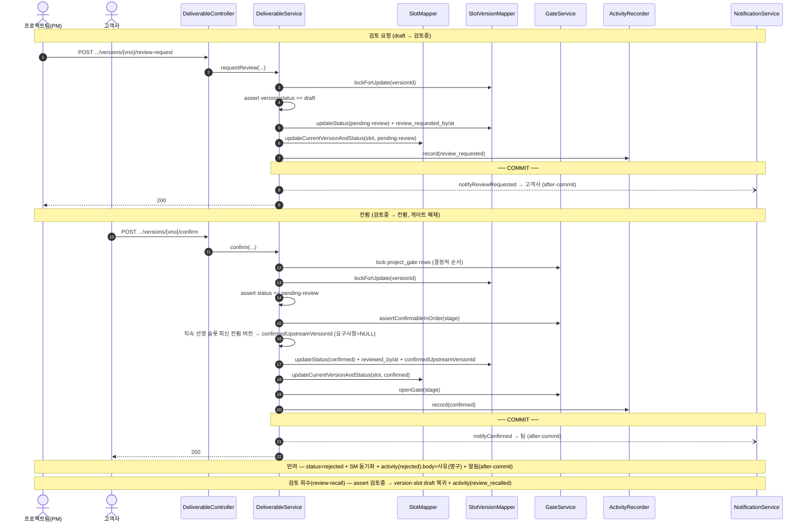
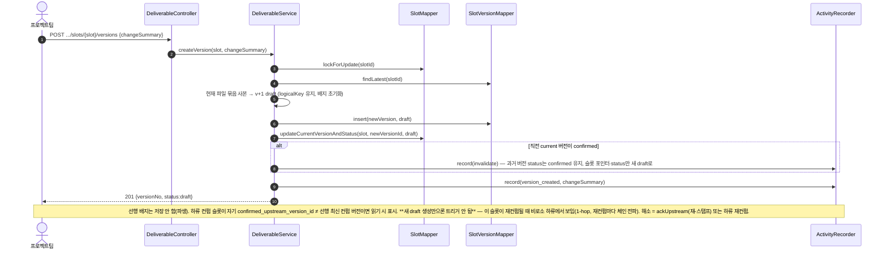
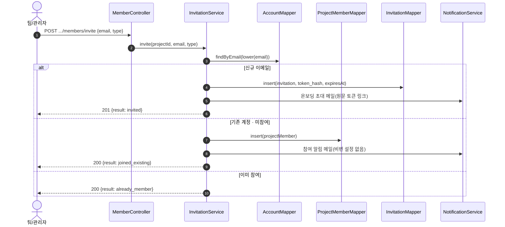
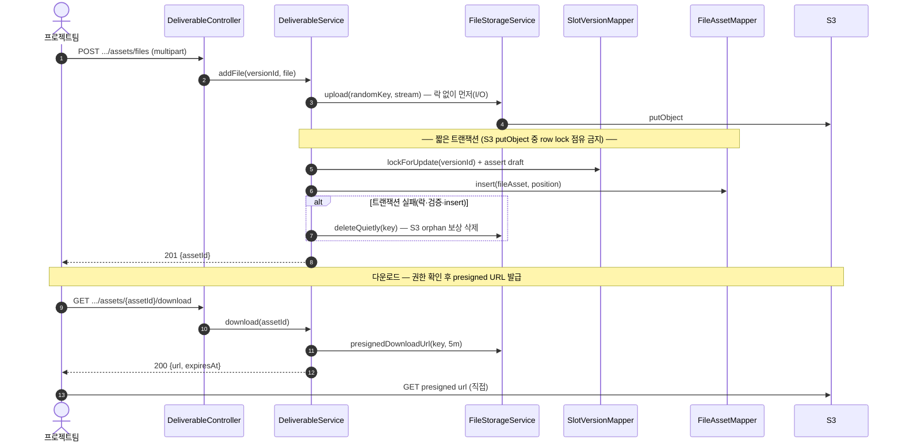
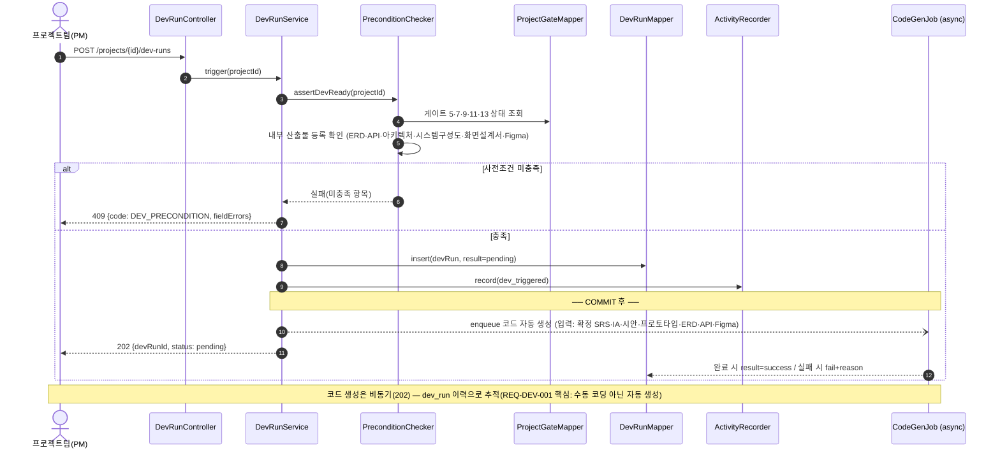

# 클래스 · 시퀀스 다이어그램

| 항목 | 내용 |
|------|------|
| 프로젝트명 | SoftPuzzle PM |
| 버전 | v0.4 (문서 정합 — 로그인 시퀀스를 Spring Security 세션으로 정렬, JWT/refresh 제거) · v0.3 (dev_run 트리거 시퀀스) · v0.2 (코덱스 리뷰) |
| 작성일 | 2026-05-21 |
| 기준 | ERD(`erd.md` v1.2) · API 명세서(`api-spec.md` v0.3) · 화면 설계서 |
| 스택 | Spring Boot · MyBatis · PostgreSQL · Thymeleaf SSR · 세션(Spring Security + Spring Session JDBC) · S3 |
| 관련 단계 | 17~18 (선택 산출물 — 객체 구조·처리 흐름 명세) |

> 산출물 No.13(선택). ERD/API와 같은 Mermaid 마크다운. **전 도메인을 다 그리지 않고**, 가장 복잡한 **산출물 슬롯 워크플로우**를 대표로 계층 구조를 보이고, 핵심 흐름만 시퀀스로 명세한다. 다른 도메인(TC·결함·계정 등)도 동일한 `Controller → Service → Mapper` 계층을 따른다.

---

## 1. 계층 아키텍처 — 클래스 다이어그램 (대표: 산출물 도메인)

> 얇은 Controller(검증·DTO 변환) → 트랜잭션 경계 Service(비즈니스 규칙) → MyBatis Mapper(SQL). 횡단 관심사(인증·알림·활동기록·파일저장)는 별도 컴포넌트로 분리.

> 공통: 모든 Controller는 `@RestController` + `ApiResponse<T>` 봉투, 예외는 `@RestControllerAdvice`가 `{success:false, code, message}`로 변환. Service는 `@Transactional`(읽기는 `readOnly=true`). 인증은 `JwtAuthFilter` → `SecurityContext`. 동시성 민감 동작은 `lockForUpdate`(SELECT … FOR UPDATE, api-spec §14).
>
> **트랜잭션 자세** (코덱스 리뷰): `GateService`·`ActivityRecorder`는 **호출자 트랜잭션에 참여**(독립 tx 아님). `NotificationService`는 **DB 알림 row 기록(tx 내) + 외부 발송(메일·푸시)은 커밋 후**(`@TransactionalEventListener(AFTER_COMMIT)` 또는 outbox)로 분리 — tx 안에서 외부 발송 금지. `FileStorageService`는 인프라 경계로 워크플로우 규칙을 갖지 않음.
>
> **파생 필드**: `DeliverableSlot.isUpstreamChanged()`는 **저장 컬럼이 아니라 파생** — 하류 슬롯의 현재 컨펌 버전 `confirmed_upstream_version_id` ≠ 직속 선행 슬롯의 최신 컨펌 버전이면 true(읽기 시 계산). 중복 저장 금지(ERD에 컬럼 없음). *프로토타입은 데모 편의상 flag로 표현*.
>
> **인가**: Controller/Security 레이어가 Service 호출 **전에** 프로젝트 멤버십(`project_member`, `left_at IS NULL`)·tier(admin=읽기 전용)를 검증(api-spec §1-5). Service는 인가 통과를 전제.

---

## 2. 시퀀스 다이어그램

### 2-1. 로그인 · 로그아웃 (Spring Security 세션)

### 2-2. 검토 요청 → 컨펌 / 반려 (게이트 해제)

### 2-3. 새 버전 만들기 (컨펌 무효화 + 선행 배지 전파, REQ-WF-005)

### 2-4. 멤버 초대 (스마트 분기 — 신규 / 기존)

### 2-5. 파일 업로드(S3) · presigned 다운로드

### 2-6. 개발 시작 트리거 (사전조건 검증 → 코드 자동 생성, REQ-DEV-001)

---

## 3. 노트

- **계층 일관성**: TC·결함·프로젝트·계정 등 다른 도메인도 `Controller → Service(@Transactional) → Mapper` 동일 패턴. 본 문서는 가장 복잡한 산출물 워크플로우만 대표로 명세.
- **트랜잭션·동시성**: 상태 전이(검토 요청/회수/컨펌/반려/새 버전)는 `SELECT … FOR UPDATE`로 직렬화 (api-spec §14, ERD 부분 유니크 보완). **컨펌은 버전 락만으론 부족** — `project_gate`/`project` 행을 결정적 순서로 락해 게이트 순서 동시성 보장. **외부 알림은 커밋 후** 발송.
- **용어 매핑**: API `POST /upstream-review` ↔ 클래스 `DeliverableService.ackUpstream(slot)` — 하류 슬롯의 `confirmed_upstream_version_id`를 현재 선행 최신 컨펌 버전으로 **재-스탬프**(배지 파생 해소) + `activity_event.upstream_reviewed`.
- **자산 삭제 보상**: `FileAssetMapper.delete`는 **draft 한정**, `kind=file`이면 DB row 삭제 + S3 object 삭제(또는 GC 큐), `kind=url`이면 row만.
- **반려 사유**·**활동 이력**: `activity_event`(append-only)에 기록, 코멘트와 분리(REQ-WF-004/CMT-002).
- **보안**: **Spring Security 세션 인증**(JWT 아님), 로그아웃=세션 무효화·30분 만료, CSRF 토큰(상태 변경), 초대/재설정 토큰 해시 저장, presigned 단명 URL — ERD·api-spec과 동일.
- **구현됨(MVP)**: TC 실패→결함 등록·양방향 연결/해제, TC CSV import(클라이언트 파싱·미리보기 후 일괄 등록), TC 수정·담당자 단건/일괄 지정(팀 QA), 결함 수정(팀 또는 본인 등록 고객사·담당자는 팀만). 모두 단순 CRUD + 서비스 가드.
- **미작성(후속 필요 시)**: 검색 인덱싱, 알림 fan-out 상세. (단순 CRUD·JIT로 충분)
