# ERD 및 테이블 정의서

| 항목 | 내용 |
|------|------|
| 프로젝트명 | SoftPuzzle PM |
| 버전 | v1.1 (코덱스 리뷰 반영 — 무결성/인덱스 보강: activity_event→slot_version_id FK, file_asset logical_key·position, current_version 복합 FK, slot_version 검토중 1개·상태 CHECK, account 조건 CHECK, ASCII 머신 코드 통일, §6 인덱스·제약 신설, refresh_token 보강) |
| 이전 버전 | v1.0 (화면설계서 전수 대조 — project 기간·설명, TC 절차/기대/실제, defect 재현단계/환경/등록자/`재현불가`, comment 결함 귀속) · v0.3 (미결 7건 해소) |
| 작성일 | 2026-05-21 |
| 기준 | SRS(`requirements.md`) · IA(`ia.md`) · 화면 설계서(`screen-design/`) · 프로토타입(`prototype/index.html`)의 데이터 모델에서 역도출 |
| 대상 DBMS | PostgreSQL 16 (운영) · MyBatis 매핑 |
| 관련 단계 | 14~15 (화면 설계서·프로토타입과 병행, Gate 15 전 v1.0 목표) |

> 산출물 No.9 (deliverables.md). 화면 설계서 v0.5+ 도메인을 근거로 작성하며, 화면 설계서·프로토타입 변경 시 동기화한다.

---

## 1. 설계 원칙

- **명명**: 테이블·컬럼 `snake_case`, 테이블은 단수형(`account`, 복수 아님). 조인 테이블은 `a_b` 패턴(`test_defect_link`).
- **기본키**: 모든 테이블 `id` 대리키. 표기는 `BIGSERIAL`이나 구현은 PG16 권장 스타일 `BIGINT GENERATED BY DEFAULT AS IDENTITY` 사용. 화면 표시용 업무 코드(`TC-001`, `DEF-001`)는 별도 `code` 컬럼으로 분리.
- **외래키**: `<참조테이블>_id` 형식. **PostgreSQL은 FK 자동 인덱스 없음 → §6에서 명시.** 삭제 정책은 도메인별 명시(이력성은 RESTRICT/소프트, 종속 묶음은 CASCADE, 로그성은 SET NULL — §6).
- **시각**: `TIMESTAMPTZ`(UTC 저장, 표시 KST). 생성·수정 `created_at`/`updated_at` 공통.
- **삭제**: 이력·감사 대상(코멘트·활동·감사로그)은 **소프트 삭제**(`deleted_at`) 또는 append-only. 그 외는 물리 삭제 허용.
- **열거형**: PostgreSQL `ENUM` 대신 `VARCHAR + CHECK` 채택 (MyBatis 매핑·값 추가 용이). **값은 ASCII 머신 코드, UI 한글 라벨은 앱에서 매핑**(인코딩·연동 안정성, DB/표시 분리). 허용값·매핑은 §5.
- **금액·크기**: 파일 크기 `BIGINT`(bytes). 표시 단위(MB)는 애플리케이션 변환.

---

## 2. ER 다이어그램

```mermaid
erDiagram
    CLIENT_ORG     ||--o{ PROJECT          : "발주"
    CLIENT_ORG     ||--o{ ACCOUNT          : "소속(고객사 계정)"
    ACCOUNT        ||--o{ PROJECT_MEMBER   : "참여"
    PROJECT        ||--o{ PROJECT_MEMBER   : "구성원"
    ACCOUNT        ||--o{ INVITATION       : "발송"
    PROJECT        ||--o{ INVITATION       : "대상"
    PROJECT        ||--o{ PROJECT_GATE     : "게이트"
    PROJECT        ||--o{ DELIVERABLE_SLOT : "산출물 슬롯"
    DELIVERABLE_SLOT ||--o{ SLOT_VERSION   : "버전 스냅샷"
    DELIVERABLE_SLOT ||--o{ ACTIVITY_EVENT : "활동 이력"
    SLOT_VERSION   ||--o{ FILE_ASSET       : "파일 묶음"
    SLOT_VERSION   ||--o{ COMMENT          : "코멘트(스냅샷별)"
    DEFECT         ||--o{ COMMENT          : "코멘트"
    PROJECT        ||--o{ TEST_CASE        : "TC"
    PROJECT        ||--o{ DEFECT           : "결함"
    TEST_CASE      ||--o{ TEST_DEFECT_LINK : ""
    DEFECT         ||--o{ TEST_DEFECT_LINK : ""
    DEFECT         ||--o{ DEFECT_ATTACHMENT : "첨부"
    ACCOUNT        ||--o{ TEST_CASE        : "담당(QA)"
    ACCOUNT        ||--o{ DEFECT           : "담당(개발)"
    ACCOUNT        ||--o{ NOTIFICATION     : "수신"
    ACCOUNT        ||--o{ REFRESH_TOKEN    : "세션"
    ACCOUNT        ||--o{ AUDIT_LOG        : "행위자"
    PROJECT        ||--o{ DEV_RUN          : "개발 실행"
    PROJECT        ||--o{ CODE_SEQUENCE    : "코드 채번"

    CLIENT_ORG {
        bigint id PK
        varchar name "㈜OO"
    }
    ACCOUNT {
        bigint id PK
        varchar email UK
        varchar name
        varchar tier "admin/team/client"
        varchar job "pm/planner/designer/developer/qa"
        bigint client_org_id FK "고객사 계정만"
        varchar status "active/pending/inactive"
    }
    PROJECT {
        bigint id PK
        varchar name
        bigint client_org_id FK
        varchar type "SaaS/웹사이트/모바일"
        text description
        date start_date
        date end_date
        smallint current_stage "1~24"
        varchar status
    }
    PROJECT_MEMBER {
        bigint id PK
        bigint project_id FK
        bigint account_id FK
        timestamptz joined_at
        timestamptz left_at "소프트 제외"
    }
    INVITATION {
        bigint id PK
        varchar email
        bigint project_id FK
        varchar invite_type "client/team_member"
        varchar token UK
        varchar status "pending/accepted/expired"
        timestamptz expires_at
        bigint invited_by FK
    }
    PROJECT_GATE {
        bigint id PK
        bigint project_id FK
        smallint gate_stage "9/11/13/15/22"
        varchar status "pass/wait/lock"
        timestamptz passed_at
    }
    DELIVERABLE_SLOT {
        bigint id PK
        bigint project_id FK
        varchar slot_type "requirements/ia/design/prototype/figma"
        bigint current_version_id FK
        varchar status "empty/draft/pending-review/confirmed/rejected"
    }
    SLOT_VERSION {
        bigint id PK
        bigint slot_id FK
        smallint version_no "1,2,3"
        varchar status "draft/pending-review/confirmed/rejected"
        text change_summary "변경 요약(v>1 필수)"
        bigint review_requested_by FK
        bigint reviewed_by FK
    }
    FILE_ASSET {
        bigint id PK
        bigint slot_version_id FK
        varchar asset_kind "file/url"
        varchar logical_key "버전 간 동일파일 식별"
        int position
        varchar original_name
        varchar content_type "MIME (file)"
        bigint size_bytes
        varchar storage_key "S3 (file)"
        varchar external_url "url (Figma)"
    }
    COMMENT {
        bigint id PK
        bigint slot_version_id FK "slot 코멘트"
        bigint defect_id FK "defect 코멘트"
        bigint author_id FK
        text body
        timestamptz deleted_at
    }
    ACTIVITY_EVENT {
        bigint id PK
        bigint slot_id FK
        varchar event_type
        bigint slot_version_id FK
        bigint actor_id FK
        text body
    }
    TEST_CASE {
        bigint id PK
        bigint project_id FK
        varchar code "TC-001 (프로젝트별)"
        varchar title
        varchar phase
        varchar priority "High/Medium/Low"
        varchar status "passed/failed/pending"
        text precondition
        text steps
        text expected_result
        text actual_result
        bigint assignee_id FK
    }
    DEFECT {
        bigint id PK
        bigint project_id FK
        varchar code "DEF-001 (프로젝트별)"
        varchar title
        varchar severity "High/Medium/Low"
        varchar status "open/in_progress/resolved/cannot_reproduce"
        text repro_steps
        varchar environment
        bigint reporter_id FK
        bigint assignee_id FK
    }
    TEST_DEFECT_LINK {
        bigint test_case_id FK
        bigint defect_id FK
    }
    DEFECT_ATTACHMENT {
        bigint id PK
        bigint defect_id FK
        varchar original_name
        varchar content_type "MIME"
        bigint size_bytes
        varchar storage_key "S3"
    }
    NOTIFICATION {
        bigint id PK
        bigint recipient_id FK
        varchar type
        text body
        boolean is_read
    }
    AUDIT_LOG {
        bigint id PK
        bigint actor_id FK
        varchar actor_role
        varchar action
        varchar target
        inet ip
    }
    DEV_RUN {
        bigint id PK
        bigint project_id FK
        varchar result "success/fail"
        text reason
    }
    CODE_SEQUENCE {
        bigint project_id FK
        varchar entity_type "test_case/defect"
        int next_no
    }
    REFRESH_TOKEN {
        bigint id PK
        bigint account_id FK
        varchar token_hash UK
        timestamptz expires_at
        timestamptz revoked_at
    }
```

---

## 3. 도메인별 테이블 정의

### 3-1. 계정·조직

#### `client_org` — 고객사(발주사)
| 컬럼 | 타입 | 제약 | 설명 |
|------|------|------|------|
| id | BIGSERIAL | PK | |
| name | VARCHAR(100) | NN, UQ | 회사명 (㈜OO) |
| created_at | TIMESTAMPTZ | NN, default now() | |

#### `account` — 사용자 계정 (3-tier 통합)
| 컬럼 | 타입 | 제약 | 설명 |
|------|------|------|------|
| id | BIGSERIAL | PK | |
| email | VARCHAR(255) | NN, UQ(lower(email)) | 로그인 ID(대소문자 무시 유일). 고객사 계정도 이메일당 1개(REQ-AUT-002) |
| name | VARCHAR(50) | NN | |
| tier | VARCHAR(20) | NN, CHECK | `admin`/`team`/`client` (UI: 관리자/프로젝트팀/고객사) |
| job | VARCHAR(20) | NULL, CHECK | 팀 한정: `pm`/`planner`/`designer`/`developer`/`qa` |
| client_org_id | BIGINT | FK→client_org, NULL | 고객사 tier만 채움 |
| password_hash | VARCHAR(255) | NULL | 온보딩(최초 1회) 후 설정. 미설정=초대 대기 |
| status | VARCHAR(20) | NN, CHECK | `active`/`pending`/`inactive` |
| created_at | TIMESTAMPTZ | NN | |
| | | CHECK | tier별 일관성: `client`⇒client_org_id NN·job NULL / `team`⇒job NN·client_org_id NULL / `admin`⇒둘 다 NULL |

> 비고: `tier` 별 컬럼 사용 — 고객사=`client_org_id`, 팀=`job`. 관리자=둘 다 NULL. RBAC는 MVP 제외, tier만 구분.

#### `project` — 프로젝트
| 컬럼 | 타입 | 제약 | 설명 |
|------|------|------|------|
| id | BIGSERIAL | PK | |
| name | VARCHAR(100) | NN | |
| client_org_id | BIGINT | FK→client_org, NN | 발주 고객사 |
| type | VARCHAR(20) | CHECK | `SaaS`/`웹사이트`/`모바일` |
| description | TEXT | NULL | 프로젝트 설명 (SCR-SET-001 편집) |
| start_date | DATE | NULL | 기간 시작 |
| end_date | DATE | NULL | 기간 종료 |
| current_stage | SMALLINT | NN, default 1 | 1~24 진행 단계 |
| status | VARCHAR(20) | NN | 진행/완료 등 |
| created_at | TIMESTAMPTZ | NN | 생성일(수정 불가, SCR-SET-001) |
| | | CHECK | `end_date >= start_date` (둘 다 NN일 때) |

#### `project_member` — 프로젝트 참여(N:M)
| 컬럼 | 타입 | 제약 | 설명 |
|------|------|------|------|
| id | BIGSERIAL | PK | |
| project_id | BIGINT | FK→project, NN | |
| account_id | BIGINT | FK→account, NN | |
| invited_by | BIGINT | FK→account, NULL | |
| joined_at | TIMESTAMPTZ | NN | |
| left_at | TIMESTAMPTZ | NULL | **소프트 제외**(라운드 40). NULL=현재 참여, 값=제외 시점. 활성 멤버 = `left_at IS NULL`. 재추가 = 같은 행 reactivate(`left_at`=NULL, `joined_at` 갱신). 팀원·고객사 공통 |
| | | UQ(project_id, account_id) | 1쌍 1행(reactivate 방식). 다중 참여 기간 이력이 필요하면 `UNIQUE(...) WHERE left_at IS NULL` 부분 인덱스로 전환 |

> 팀원 배정·고객사 참여를 같은 junction으로 표현(REQ-AUT-002). 고객사 1계정이 여러 프로젝트 참여 가능(N:M, 라운드 40). 제외는 소프트(`left_at`) — 계정·코멘트·컨펌·감사 이력 보존. 제외 행위자는 `audit_log`에 기록.

#### `invitation` — 초대
| 컬럼 | 타입 | 제약 | 설명 |
|------|------|------|------|
| id | BIGSERIAL | PK | |
| email | VARCHAR(255) | NN | 초대 대상 |
| project_id | BIGINT | FK→project, NN | 참여 프로젝트 |
| invite_type | VARCHAR(20) | NN, CHECK | `client`/`team_member` |
| token | VARCHAR(255) | NN, UQ | 1회용. 수락·재발송 시 무효화(REQ-AUT-012) |
| status | VARCHAR(20) | NN, CHECK | `pending`/`accepted`/`expired` |
| invited_by | BIGINT | FK→account, NN | |
| expires_at | TIMESTAMPTZ | NN | 30분 유효 |
| accepted_at | TIMESTAMPTZ | NULL | |
| created_at | TIMESTAMPTZ | NN | |
| | | UQ(부분) | 활성 중복 초대 방지: `UNIQUE(project_id, lower(email), invite_type) WHERE status='pending'` |

> 신규 이메일=온보딩 초대, 기존 계정=참여만 추가+알림(라운드 40 스마트 분기) — 분기는 애플리케이션 로직, 테이블은 동일.

### 3-2. 게이트·산출물·워크플로우

#### `project_gate` — 게이트 상태
| 컬럼 | 타입 | 제약 | 설명 |
|------|------|------|------|
| id | BIGSERIAL | PK | |
| project_id | BIGINT | FK→project, NN | |
| gate_stage | SMALLINT | NN, CHECK | `9`/`11`/`13`/`15`/`22` |
| status | VARCHAR(10) | NN, CHECK | `pass`/`wait`/`lock` |
| passed_at | TIMESTAMPTZ | NULL | |
| passed_by | BIGINT | FK→account, NULL | 컨펌한 고객사 계정 |
| | | UQ(project_id, gate_stage) | |

> 소프트 게이트(REQ-WF-003): 내비·선행 작업은 허용, 컨펌만 순서 강제. `status`는 컨펌 순서 검증용.

#### `deliverable_slot` — 산출물 슬롯
| 컬럼 | 타입 | 제약 | 설명 |
|------|------|------|------|
| id | BIGSERIAL | PK | |
| project_id | BIGINT | FK→project, NN | |
| slot_type | VARCHAR(20) | NN, CHECK | `requirements`/`ia`/`design`/`prototype`/`figma` |
| current_version_id | BIGINT | FK→slot_version, NULL | 최신 버전 캐시 포인터(역정규화). **복합 FK `(id, current_version_id) → slot_version(slot_id, id)`** 로 타 슬롯 버전 참조 방지(slot_version에 UNIQUE(slot_id,id) 필요) |
| status | VARCHAR(20) | NN, CHECK | `empty`/`draft`/`pending-review`/`confirmed`/`rejected` (current_version 미러 — 앱이 동기 유지) |
| created_at | TIMESTAMPTZ | NN | |
| | | UQ(project_id, slot_type) | 프로젝트당 슬롯 1개 |

> 요구사항도 슬롯의 일종(통합 모델). 프로젝트 생성 시 5개 슬롯 생성(요구사항·IA·시안·프로토타입·Figma).

#### `slot_version` — 슬롯 버전 스냅샷
| 컬럼 | 타입 | 제약 | 설명 |
|------|------|------|------|
| id | BIGSERIAL | PK | |
| slot_id | BIGINT | FK→deliverable_slot, NN | |
| version_no | SMALLINT | NN | 1,2,3 (major-only, REQ-FILE-002) |
| status | VARCHAR(20) | NN, CHECK | `draft`/`pending-review`/`confirmed`/`rejected` |
| change_summary | TEXT | NULL | 변경 요약 메모 (v>1 필수, MOD-VER-001) |
| created_by | BIGINT | FK→account, NN | |
| created_at | TIMESTAMPTZ | NN | |
| review_requested_by | BIGINT | FK→account, NULL | 검토 요청 발송자 |
| review_requested_at | TIMESTAMPTZ | NULL | 발송 시각 = 잠금 시점 |
| reviewed_by | BIGINT | FK→account, NULL | 컨펌·반려한 고객사 |
| reviewed_at | TIMESTAMPTZ | NULL | |
| confirmed_upstream_version_id | BIGINT | FK→slot_version, NULL | **컨펌 시점 직속 선행 슬롯의 버전**. REQ-WF-005 `선행 산출물 변경·검토 권장` 배지 판정용 — 선행 슬롯 최신 컨펌 버전과 다르면 배지. `검토 완료(영향 없음)` 시 현재 선행 버전으로 **재-스탬프**(= 무엇을 승인했는지 보존). 요구사항 슬롯은 항상 NULL. **앱 불변식**: 직속 선행 슬롯의 *컨펌된* 버전만 가리킴(DB FK로는 강제 불가) |
| | | UQ(slot_id, version_no) | |
| | | UQ(slot_id, id) | 복합 FK 대상(deliverable_slot.current_version_id) |
| | | UQ(부분) | **슬롯당 검토중 1개**: `UNIQUE(slot_id) WHERE status='pending-review'` |
| | | CHECK | 상태별 review 필드 일관성: `draft`⇒review/reviewed 필드 NULL · `pending-review`⇒review_requested_* NN·reviewed_* NULL · `confirmed`/`rejected`⇒review_requested_*·reviewed_* NN |

> 한 버전 = 파일 묶음 전체(스냅샷). 검토 요청·컨펌·반려의 단위. 잠긴 버전(검토중·컨펌·반려)은 immutable.

#### `file_asset` — 파일·링크 (버전 묶음)
| 컬럼 | 타입 | 제약 | 설명 |
|------|------|------|------|
| id | BIGSERIAL | PK | |
| slot_version_id | BIGINT | FK→slot_version, NN | 소속 버전 스냅샷 |
| asset_kind | VARCHAR(10) | NN, CHECK(`file`/`url`), default `file` | 업로드 파일 vs 외부 링크(Figma 등) |
| logical_key | VARCHAR(255) | NN | **버전 간 동일 파일 식별자** — NEW/교체/삭제 diff·"v2에서 교체됨" 판정용(파일명 대신). 새 버전 생성 시 베이스 항목은 동일 키 유지 |
| position | INT | NN, default 0 | 묶음 내 표시 순서 |
| original_name | VARCHAR(255) | NN | 표시명. file=파일명(자유), url=링크 라벨 |
| description | VARCHAR(255) | NULL | |
| content_type | VARCHAR(100) | NULL | file 한정. MIME. 뷰어 분기(REQ-FILE-003): `application/pdf`·`image/*`=미리보기, 그 외 다운로드 폴백 |
| size_bytes | BIGINT | NULL, CHECK(`<= 50*1024*1024`) | file 한정(REQ-FILE-001, 50MB) |
| storage_key | VARCHAR(512) | NULL | file 한정. S3 객체 키 |
| external_url | VARCHAR(2048) | NULL | url 한정. Figma 버전/Dev Mode 링크 권장 |
| uploaded_by | BIGINT | FK→account, NN | |
| uploaded_at | TIMESTAMPTZ | NN | |
| | | CHECK | `file`→storage_key·content_type·size_bytes NN / `url`→external_url NN |
| | | UQ(부분) | file 한정 storage_key 유일: `UNIQUE(storage_key) WHERE asset_kind='file'`. 또한 `UNIQUE(slot_version_id, logical_key)` (버전 내 동일 키 1개) |

> 한 버전 묶음은 **파일 + 외부 링크 혼재** 허용(REQ-FILE-001). `asset_kind='url'`이면 뷰어 대신 **링크 열기**. **Figma 핸드오프(REQ-DSN-004) = url 1개(필수) + 선택 export 에셋(file)** 의 묶음으로 표현. 라이브 URL은 가변이라 버전 링크 사용 권장(강제 불가, Figma는 고객 게이트 아님). **NEW/교체/삭제 배지·"v2에서 교체됨"은 `logical_key`로 버전 간 diff** (파일명 변경에 강건), 배지 자체는 파생(미저장).

#### `comment` — 코멘트 (버전 스냅샷별)
| 컬럼 | 타입 | 제약 | 설명 |
|------|------|------|------|
| id | BIGSERIAL | PK | |
| slot_version_id | BIGINT | FK→slot_version, NULL | 슬롯 코멘트면 채움(스냅샷별 귀속, 라운드 36) |
| defect_id | BIGINT | FK→defect, NULL | 결함 코멘트면 채움(SCR-TST-004) |
| author_id | BIGINT | FK→account, NN | |
| body | TEXT | NN | |
| created_at | TIMESTAMPTZ | NN | |
| edited_at | TIMESTAMPTZ | NULL | 본인 수정 |
| deleted_at | TIMESTAMPTZ | NULL | 소프트 삭제. 관리자 강제 삭제 시 audit 기록 |
| | | CHECK | `slot_version_id`·`defect_id` 중 **정확히 하나**만 NOT NULL (소유자 단일) |

> 슬롯 버전 또는 결함에 귀속(둘 중 하나). 구조가 동일해 단일 테이블 + nullable FK로 통합. 일반 토론용, 활동 이력에는 코멘트 미기록(REQ-WF-004). 본인만 수정·삭제 + 관리자 강제 삭제(REQ-CMT-001). **반려 사유(REQ-CMT-002)는 코멘트가 아니라 `activity_event(rejected).body`에 단일 저장**(영구 보존 — 코멘트는 수정·삭제 가능하므로 분리).

#### `activity_event` — 활동 이력 (시스템 이벤트)
| 컬럼 | 타입 | 제약 | 설명 |
|------|------|------|------|
| id | BIGSERIAL | PK | |
| slot_id | BIGINT | FK→deliverable_slot, NN | 버전 무관 전체(슬롯 단위) |
| event_type | VARCHAR(30) | NN, CHECK | `version_created`/`review_requested`/`review_recalled`/`confirmed`/`rejected`/`invalidated`/`upstream_reviewed`(선행 변경 `검토 완료(영향 없음)`) |
| slot_version_id | BIGINT | FK→slot_version, NULL | 관련 버전(FK 안전). 표시용 version_no는 조인으로 파생 |
| actor_id | BIGINT | FK→account, NN | |
| body | TEXT | NULL | 변경 요약 · **반려 사유(REQ-CMT-002 단일 소스)** 등 |
| created_at | TIMESTAMPTZ | NN | append-only(수정·삭제 불가) |

### 3-3. 테스트·결함

#### `test_case` — 테스트 케이스
| 컬럼 | 타입 | 제약 | 설명 |
|------|------|------|------|
| id | BIGSERIAL | PK | |
| project_id | BIGINT | FK→project, NN | |
| code | VARCHAR(20) | NN | `TC-001`. **프로젝트별 채번**(code_sequence). 표시·CSV 가져오기 키 |
| title | VARCHAR(200) | NN | |
| phase | VARCHAR(30) | NN | 인증/요구사항/워크플로우/코멘트/개발 등 |
| priority | VARCHAR(10) | NN, CHECK | `High`/`Medium`/`Low` |
| status | VARCHAR(10) | NN, CHECK | `passed`/`failed`/`pending` (UI: 통과/실패/대기) |
| precondition | TEXT | NULL | 전제 조건 (SCR-TST-002) |
| steps | TEXT | NULL | 테스트 절차 (순서 목록, 줄바꿈 구분) |
| expected_result | TEXT | NULL | 기대 결과 |
| actual_result | TEXT | NULL | 실제 결과 (실행 시 입력) |
| assignee_id | BIGINT | FK→account, NULL | QA 담당 |
| created_at | TIMESTAMPTZ | NN | |
| | | UQ(project_id, code) | 프로젝트 내 유일 |

> 단건 폼 등록 + CSV/Excel 일괄 가져오기(REQ-TST-001, 라운드 41). 절차/기대/실제는 상세 화면(SCR-TST-002) 필드. 순서 목록은 MVP는 TEXT, 정규화는 후속.

#### `defect` — 결함
| 컬럼 | 타입 | 제약 | 설명 |
|------|------|------|------|
| id | BIGSERIAL | PK | |
| project_id | BIGINT | FK→project, NN | |
| code | VARCHAR(20) | NN | `DEF-001`. **프로젝트별 채번**(code_sequence) |
| title | VARCHAR(200) | NN | |
| severity | VARCHAR(10) | NN, CHECK | `High`/`Medium`/`Low` |
| status | VARCHAR(15) | NN, CHECK | `open`/`in_progress`/`resolved`/`cannot_reproduce` (UI: 미해결/진행중/해결완료/재현불가) |
| repro_steps | TEXT | NULL | 재현 단계 (순서 목록, SCR-TST-004) |
| environment | VARCHAR(200) | NULL | 환경 (브라우저·OS·시각) |
| reporter_id | BIGINT | FK→account, NULL | 등록자 (팀/고객사) |
| assignee_id | BIGINT | FK→account, NULL | 개발 담당 |
| created_at | TIMESTAMPTZ | NN | |
| | | UQ(project_id, code) | 프로젝트 내 유일 |

#### `test_defect_link` — TC↔결함 연결 (N:M)
| 컬럼 | 타입 | 제약 | 설명 |
|------|------|------|------|
| test_case_id | BIGINT | FK→test_case, NN | |
| defect_id | BIGINT | FK→defect, NN | |
| created_at | TIMESTAMPTZ | NN | |
| | | PK(test_case_id, defect_id) | 양방향 연결(REQ-TST-001) |

#### `defect_attachment` — 결함 첨부 (증거 파일)
| 컬럼 | 타입 | 제약 | 설명 |
|------|------|------|------|
| id | BIGSERIAL | PK | |
| defect_id | BIGINT | FK→defect, NN | |
| original_name | VARCHAR(255) | NN | |
| content_type | VARCHAR(100) | NN | MIME |
| size_bytes | BIGINT | NN, CHECK(≤50MB) | |
| storage_key | VARCHAR(512) | NN | S3 객체 키 |
| uploaded_by | BIGINT | FK→account, NN | |
| uploaded_at | TIMESTAMPTZ | NN | |

> 스크린샷·로그 등 결함 증거 파일. 버전·컨펌 없음(슬롯 묶음과 별개). 뷰어(REQ-FILE-003) 적용은 UI 후속 결정(이미지·PDF 미리보기 가능).

### 3-4. 공통

#### `notification` — 알림
| 컬럼 | 타입 | 제약 | 설명 |
|------|------|------|------|
| id | BIGSERIAL | PK | |
| recipient_id | BIGINT | FK→account, NN | |
| type | VARCHAR(30) | NN | 검토 요청·컨펌·반려·참여 알림 등(REQ-NTF-001) |
| body | TEXT | NN | |
| link | VARCHAR(512) | NULL | 관련 화면 경로 |
| is_read | BOOLEAN | NN, default false | |
| created_at | TIMESTAMPTZ | NN | |

#### `audit_log` — 감사 로그 (append-only)
| 컬럼 | 타입 | 제약 | 설명 |
|------|------|------|------|
| id | BIGSERIAL | PK | |
| actor_id | BIGINT | FK→account, SET NULL | 시스템 이벤트는 NULL |
| actor_role | VARCHAR(20) | NN | 행위 시점 tier 스냅샷 |
| action | VARCHAR(100) | NN | 로그인·파일 교체·컨펌·초대 재발송 등 |
| target | VARCHAR(255) | NULL | 대상 식별 |
| ip | INET | NULL | |
| created_at | TIMESTAMPTZ | NN | REQ-AUD-001. 수정·삭제 불가 |

#### `dev_run` — 개발(코드 자동 생성) 실행 이력
| 컬럼 | 타입 | 제약 | 설명 |
|------|------|------|------|
| id | BIGSERIAL | PK | |
| project_id | BIGINT | FK→project, NN | |
| result | VARCHAR(10) | NN, CHECK | `success`/`fail` |
| reason | TEXT | NULL | 실패 사유(예: 입력 검증 — 요구사항 미컨펌) |
| triggered_by | BIGINT | FK→account, NULL | |
| created_at | TIMESTAMPTZ | NN | |

> 18단계(REQ-DEV-001) 트리거. 하드 사전조건(4개 게이트 통과) 미충족 시 차단.

#### `code_sequence` — 업무코드 채번 카운터
| 컬럼 | 타입 | 제약 | 설명 |
|------|------|------|------|
| project_id | BIGINT | FK→project, NN | |
| entity_type | VARCHAR(20) | NN, CHECK | `test_case`/`defect` |
| next_no | INT | NN, default 1 | 다음 채번 값 |
| | | PK(project_id, entity_type) | (프로젝트×종류)별 카운터 1행 |

> `TC-001`/`DEF-001` **프로젝트별 채번**. INSERT 트랜잭션 내 `UPDATE ... SET next_no = next_no + N RETURNING`으로 원자적 할당(행 잠금으로 직렬화). CSV 일괄 N건 = `next_no += N` 연속 블록 일괄 할당. 표시 포맷 `TC-%03d`·`DEF-%03d`.

#### `refresh_token` — 리프레시 토큰
| 컬럼 | 타입 | 제약 | 설명 |
|------|------|------|------|
| id | BIGSERIAL | PK | |
| account_id | BIGINT | FK→account, NN | |
| token_hash | VARCHAR(255) | NN, UQ | **원문 저장 금지** — HMAC/SHA-256 다이제스트(서버 pepper) |
| expires_at | TIMESTAMPTZ | NN | |
| revoked_at | TIMESTAMPTZ | NULL | 갱신·로그아웃 시 폐기 |
| revoked_reason | VARCHAR(30) | NULL | `rotated`/`logout`/`reuse_detected` 등 |
| last_used_at | TIMESTAMPTZ | NULL | 마지막 사용(재사용 탐지용) |
| created_at | TIMESTAMPTZ | NN | |

> Access token은 stateless JWT 가정(미저장), **refresh만 영속**. 갱신 = 이전 행 `revoked_at` 세팅(또는 삭제) + 새 행 insert(글로벌 규칙: 이전 토큰 명시적 폐기). **이미 폐기된 토큰 재사용 시 = 탈취 의심 → 해당 계정 토큰 전체 폐기**(reuse detection). 초대 토큰은 `invitation`이 별도 관리. 비밀번호 재설정 토큰은 후속(필요 시 유사 단명 토큰 테이블).

---

## 4. 핵심 관계 요약

| 관계 | 카디널리티 | 비고 |
|------|-----------|------|
| client_org → project | 1:N | 발주사가 여러 프로젝트 |
| client_org → account(고객사) | 1:N | 고객사 회사 소속 계정 |
| account ↔ project | N:M (`project_member`) | 팀 배정·고객사 참여 통합 |
| project → project_gate | 1:N (5행) | 9·11·13·15·22 |
| project → deliverable_slot | 1:N (5행) | 요구사항·IA·시안·프로토타입·Figma |
| deliverable_slot → slot_version | 1:N | 버전 스냅샷 누적 |
| slot_version → file_asset | 1:N | 한 버전 = 파일 묶음 |
| slot_version → comment | 1:N | 스냅샷별 코멘트 |
| defect → comment | 1:N | 결함 코멘트 (comment는 slot_version·defect 중 하나에 귀속) |
| deliverable_slot → activity_event | 1:N | 슬롯 단위 전체 이력 |
| test_case ↔ defect | N:M (`test_defect_link`) | 양방향 연결 |
| defect → defect_attachment | 1:N | 증거 파일 |
| project → test_case / defect / dev_run / code_sequence | 1:N | |
| account → notification / refresh_token / audit_log | 1:N | 알림·세션·감사 |

---

## 5. 코드값(CHECK 제약) 집약

| 컬럼 | 허용값 |
|------|--------|
| account.tier | admin · team · client |
| account.job | pm · planner · designer · developer · qa |
| account.status | active · pending · inactive |
| project.type | SaaS · 웹사이트 · 모바일 |
| project_gate.gate_stage | 9 · 11 · 13 · 15 · 22 |
| project_gate.status | pass · wait · lock |
| deliverable_slot.slot_type | requirements · ia · design · prototype · figma |
| file_asset.asset_kind | file · url |
| slot_version.status / deliverable_slot.status | draft · pending-review · confirmed · rejected (slot은 empty 추가) |
| invitation.invite_type | client · team_member |
| invitation.status | pending · accepted · expired |
| activity_event.event_type | version_created · review_requested · review_recalled · confirmed · rejected · invalidated · upstream_reviewed |
| test_case.priority / defect.severity | High · Medium · Low |
| test_case.status | passed · failed · pending |
| defect.status | open · in_progress · resolved · cannot_reproduce |
| dev_run.result | success · fail |
| code_sequence.entity_type | test_case · defect |

> **DB 값 = ASCII 머신 코드, UI = 한글 라벨** (애플리케이션 매핑). 인코딩·정합·연동 안정성 + DB/표시 분리. 라벨 매핑: tier `admin`=관리자·`team`=프로젝트팀·`client`=고객사 / job `pm`=PM·`planner`=기획자·`designer`=디자이너·`developer`=개발자·`qa`=QA / TC status `passed`=통과·`failed`=실패·`pending`=대기 / defect status `open`=미해결·`in_progress`=진행중·`resolved`=해결완료·`cannot_reproduce`=재현불가.

---

## 6. 인덱스 · 추가 제약 (구현 전 적용)

> PostgreSQL은 FK에 자동 인덱스를 만들지 않음 — FK·접근 패턴별 인덱스를 명시한다. (코덱스 리뷰 반영)

**인덱스 (주요 조회 경로)**
| 인덱스 | 용도 |
|--------|------|
| `slot_version(slot_id, version_no DESC)` | 슬롯 버전 목록·최신 |
| `slot_version(slot_id, status, created_at DESC)` | 상태별 조회 |
| `file_asset(slot_version_id, position)` | 버전 파일 묶음(정렬) |
| `comment(slot_version_id, created_at) WHERE slot_version_id IS NOT NULL` | 슬롯 코멘트 |
| `comment(defect_id, created_at) WHERE defect_id IS NOT NULL` | 결함 코멘트 |
| `activity_event(slot_id, created_at DESC)` | 슬롯 활동 이력 |
| `test_defect_link(defect_id, test_case_id)` | 역방향(PK는 `(test_case_id, defect_id)`) |
| `defect(project_id, status, severity, created_at DESC)` | 결함 목록·필터 |
| `test_case(project_id, status, priority, created_at DESC)` | TC 목록·필터 |
| `notification(recipient_id, is_read, created_at DESC)` | 알림함 |
| `refresh_token(account_id, revoked_at, expires_at)` | 세션 조회·정리 |
| `project_member(account_id) WHERE left_at IS NULL` | 내 참여 프로젝트 |

**추가 제약 (본문 테이블에도 표기)**
- `account`: `UNIQUE(lower(email))`, tier별 조건 CHECK
- `project`: `CHECK(end_date >= start_date)`
- `slot_version`: `UNIQUE(slot_id, id)`(복합 FK 대상) · `UNIQUE(slot_id) WHERE status='pending-review'`(검토중 1개) · 상태-필드 일관성 CHECK
- `deliverable_slot`: 복합 FK `(id, current_version_id) → slot_version(slot_id, id)`
- `file_asset`: `UNIQUE(storage_key) WHERE asset_kind='file'` · `UNIQUE(slot_version_id, logical_key)`
- `invitation`: `UNIQUE(project_id, lower(email), invite_type) WHERE status='pending'`

**삭제 정책 (FK ON DELETE)**
- `comment`/`activity_event`/`audit_log`: 부모 silent CASCADE 금지 — 부모는 소프트 삭제 또는 RESTRICT(이력 보존). audit는 actor `SET NULL`.
- 종속 묶음(`file_asset`·`defect_attachment`)은 부모(version/defect) 삭제 시 CASCADE 허용.

---

## 7. 설계 노트 · 미결 사항 (검토 대상)

1. ~~`slot_version.upstream_baseline`~~ **(결정 완료 2026-05-21)** — REQ-WF-005 배지 저장은 **단일 FK `slot_version.confirmed_upstream_version_id`** 채택. 선행 관계가 고정 직선 체인(요구사항→IA→시안→프로토타입)이라 JSONB/별도 테이블 불필요. 직속 선행만 추적 → 재컨펌 시 체인 따라 자연 전파. 해소는 재컨펌 또는 `검토 완료(영향 없음)`(`activity_event.upstream_reviewed` 기록). **Figma는 게이트 외 핸드오프라 배지 적용 회색지대 — 후속 결정.** (프로토타입 미구현, 정책만 SRS 명시)
2. ~~외부 URL(Figma) 저장~~ **(결정 완료 2026-05-21)** — `file_asset`에 **흡수**(별도 테이블 X). `asset_kind`(file/url) 구분자 + 전용 `external_url` 컬럼 + CHECK. 한 버전 묶음에 파일·링크 혼재. **Figma 핸드오프 = url 1개(필수) + 선택 export 에셋(file)** — `.fig` 업로드 강제 안 함(실무상 링크 핸드오프, Dev Mode). 라이브 URL 가변성은 버전 링크 권장으로 완화(강제 불가, Figma는 고객 게이트 아님). SRS REQ-FILE-001·REQ-DSN-004 반영.
3. ~~`project_member` 제외(라운드 40 소프트 제외)~~ **(결정 완료 2026-05-21)** — `left_at` 소프트 삭제 채택. NULL=참여, 값=제외. 1쌍 1행 reactivate. 활성 조회 `left_at IS NULL` 필터 필수(부분 인덱스/뷰로 방어).
4. ~~업무 코드 채번~~ **(결정 완료 2026-05-21)** — **프로젝트별 채번** 채택(`UNIQUE(project_id, code)`). `code_sequence` 카운터 테이블 + 트랜잭션 내 원자적 증가(CSV 일괄은 연속 블록 할당). 표시 `TC-%03d`·`DEF-%03d`.
5. ~~반려 사유 중복~~ **(결정 완료 2026-05-21)** — `activity_event(rejected).body` **단일 소스**(append-only·영구 보존). `comment.comment_type` 제거(코멘트는 일반 토론 전용). 코멘트는 수정·삭제 가능하므로 영구 보존 대상인 반려 사유와 분리.
6. ~~첨부(결함 첨부파일)~~ **(결정 완료 2026-05-21)** — 별도 `defect_attachment` 테이블 채택(다형성·nullable 혼용 회피, FK 무결성 유지). 뷰어 적용은 UI 후속.
7. ~~세션·인증 토큰~~ **(결정 완료 2026-05-21)** — `refresh_token` 테이블 추가(token_hash UK·expires_at·revoked_at). Access는 stateless JWT(미저장), refresh만 영속. 갱신 시 이전 토큰 폐기(글로벌 규칙). 비밀번호 재설정 토큰은 후속.
