# 프로젝트 흐름도 (MVP) — 전체 20단계

> 단계 번호는 `requirements.md`·`deliverables.md`의 **관련 단계** 컬럼과 연결됩니다.
> v2.2: 계정·접근(구 3~5단계)은 프로젝트 진행 워크플로우가 아니라 **플랫폼/관리자 레벨**(관리자 콘솔의 계정 발급·초대, 고객사 로그인)에서 처리하므로 단계에서 제외. 구 1·2단계(생성+워크스페이스 초기화)는 한 트랜잭션이라 1단계로 통합. **Figma도 다른 산출물처럼 등록(12)→컨펌(13, 게이트)**. 게이트: **5·7·9·11·13·18**.

```mermaid
flowchart TD
    A([시작]) --> B

    subgraph PRJ["프로젝트 착수 (1)"]
        B["1\n프로젝트 생성·워크스페이스 자동 초기화"]
    end

    subgraph REQ["요구사항 협의 (2~5)"]
        F["2\n요구사항 등록\n프로젝트팀 대행 입력"]
        G["3\n고객사 검토"]
        H["4\n프로젝트팀 수정·반영"]
        I{{"5\n[Gate]\n고객사 최종 컨펌"}}
    end

    subgraph DESIGN["설계 협의 (6~13)"]
        J["6\nIA 등록"]
        K["7\n고객사 IA 컨펌"]
        L["8\n디자인 시안 등록"]
        M["9\n고객사 시안 컨펌"]
        N["10\n프로토타입(HTML) 등록"]
        O["11\n고객사 프로토타입 컨펌"]
        P["12\nFigma 핸드오프 등록"]
        Q{{"13\n[Gate]\n고객사 Figma 컨펌"}}
    end

    subgraph DEV["개발 (14)"]
        R["14\n개발\nSaaS 내부 처리"]
    end

    subgraph TEST["테스트 (15~18)"]
        S["15\n테스트 항목 관리\nTC List + 결함 추적"]
        T["16\n고객사 UAT"]
        U["17\n프로젝트팀 수정·재배포"]
        V{{"18\n[Gate]\n최종 검수 컨펌\n산출물 확정"}}
    end

    subgraph OPS["이행·운영 (19~20)"]
        W["19\n산출물 Export"]
        X["20\n서비스 오픈·운영 전환"]
    end

    B --> F
    F --> G --> H --> G
    H -->|"협의 완료"| I
    I -->|"반려"| F
    I -->|"컨펌"| J
    J --> K -->|"반려"| J
    K -->|"컨펌"| L
    L --> M -->|"반려"| L
    M -->|"컨펌"| N
    N --> O -->|"반려"| N
    O -->|"컨펌"| P --> Q
    Q -->|"반려"| P
    Q -->|"컨펌"| R
    R --> S --> T --> U --> T
    U -->|"결함 없음"| V
    V -->|"반려"| S
    V -->|"컨펌"| W --> X
    X --> Z([종료])
```

## 단계별 요약표

| 단계 | 구분 | 내용 | 주체 | 비고 |
|------|------|------|------|------|
| 1 | 프로젝트 착수 | 프로젝트 생성 + 워크스페이스 자동 초기화 | PM | 생성 시 PM 자동 할당 |
| 2 | 요구사항 | 요구사항 등록 (팀 대행 입력) | PM | 고객사 직접 입력 UI는 MVP 제외 |
| 3~4 | 요구사항 | 검토·수정 왕복 반복 ↻ | 공통 | 합의까지 반복 |
| **5** | **요구사항** | **[Gate] 최종 컨펌** | **고객사** | **이후 단계 진행 게이트** |
| 6~7 | 설계 | IA 등록·컨펌 | 기획 | 수정 왕복 반복 |
| 8~9 | 설계 | 디자인 시안 등록·컨펌 | 디자이너 | 수정 왕복 반복 |
| 10~11 | 설계 | 프로토타입(HTML) 등록·컨펌 | 디자이너 | 수정 왕복 반복 |
| 12 | 설계 | Figma 핸드오프 등록 | 디자이너 | 개발 입력 + 개발자 참조 |
| **13** | **설계** | **[Gate] 고객사 Figma 컨펌** | **고객사** | **게이트 — 개발 트리거 사전조건** |
| 14 | 개발 | 개발 | 시스템 | SaaS 내부 처리 (게이트 5·7·9·11·13 통과 시) |
| 15 | 테스트 | TC 목록 관리 + 결함 추적 | QA | |
| 16~17 | 테스트 | UAT · 수정 반복 ↻ | 공통 | 결함 없을 때까지 반복 |
| **18** | **테스트** | **[Gate] 최종 검수 컨펌, 산출물 확정** | **고객사** | **게이트 + 산출물 확정** |
| 19 | 이행 | 산출물 Export | 개발 | 검수 후 수행 |
| 20 | 운영 | 서비스 오픈·운영 전환 | 운영 | MVP 최종 단계 |

> **계정·접근**(3-tier 접근 구분, 고객사 계정 발급·초대, 고객사 최초 로그인)은 프로젝트 진행 단계가 아니라 관리자 콘솔/설정에서 상시 처리됩니다. (MVP: RBAC 제외)
