# 프로젝트 흐름도 (MVP) — 전체 24단계

> 단계 번호는 `requirements.md`·`deliverables.md`의 **관련 단계** 컬럼과 연결됩니다.

```mermaid
flowchart TD
    A([시작]) --> B

    subgraph PRJ["프로젝트 착수 (1~2)"]
        B["1~2\n프로젝트 생성\n워크스페이스 자동 초기화"]
    end

    subgraph AUTH["계정·접근 (3~5)"]
        C["3\n2-tier 접근 구분 설정\n프로젝트팀 / 고객사"]
        D["4\n고객사 계정 발급·초대\nID/PW + 접속 링크 공유"]
        E["5\n고객사 최초 로그인\n프로젝트 개요(대시보드) 확인"]
    end

    subgraph REQ["요구사항 협의 (6~9)"]
        F["6\n요구사항 등록\n프로젝트팀 대행 입력"]
        G["7\n고객사 검토"]
        H["8\n프로젝트팀 수정·반영"]
        I{{"9\n[Gate]\n고객사 최종 컨펌"}}
    end

    subgraph DESIGN["설계 협의 (10~17)"]
        J["10\nIA 등록"]
        K["11\n고객사 IA 컨펌"]
        L["12\n디자인 시안 등록"]
        M["13\n고객사 시안 컨펌"]
        N["14\n프로토타입(HTML) 등록"]
        O["15\n고객사 프로토타입 컨펌"]
        P["16\nFigma 정제"]
        Q["17\n개발 핸드오프 자산 작성"]
    end

    subgraph DEV["개발 (18)"]
        R["18\nAI 자동 개발\nSaaS 내부 처리"]
    end

    subgraph TEST["테스트 (19~22)"]
        S["19\n테스트 항목 관리\nTC List + 결함 추적"]
        T["20\n고객사 UAT"]
        U["21\n프로젝트팀 수정·재배포"]
        V{{"22\n[Gate]\n최종 검수 컨펌\n산출물 확정"}}
    end

    subgraph OPS["이행·운영 (23~24)"]
        W["23\n산출물 Export"]
        X["24\n서비스 오픈·운영 전환"]
    end

    B --> C --> D --> E --> F
    F --> G --> H --> G
    H -->|"협의 완료"| I
    I -->|"반려"| F
    I -->|"컨펌"| J
    J --> K -->|"반려"| J
    K -->|"컨펌"| L
    L --> M -->|"반려"| L
    M -->|"컨펌"| N
    N --> O -->|"반려"| N
    O -->|"컨펌"| P --> Q --> R
    R --> S --> T --> U --> T
    U -->|"결함 없음"| V
    V -->|"반려"| S
    V -->|"컨펌"| W --> X
    X --> Z([종료])
```

## 단계별 요약표

| 단계 | 구분 | 내용 | 주체 | 비고 |
|------|------|------|------|------|
| 1~2 | 프로젝트 착수 | 프로젝트 생성, 워크스페이스 초기화 | PM | |
| 3 | 계정·접근 | 2-tier 접근 구분 (프로젝트팀/고객사) | PM | MVP: RBAC 제외 |
| 4 | 계정·접근 | 고객사 계정 발급·초대 | PM | |
| 5 | 계정·접근 | 고객사 최초 로그인 + 대시보드 확인 | 고객사 | |
| 6 | 요구사항 | 요구사항 등록 (팀 대행 입력) | PM | 고객사 직접 입력 UI는 MVP 제외 |
| 7~8 | 요구사항 | 검토·수정 왕복 반복 ↻ | 공통 | 합의까지 반복 |
| **9** | **요구사항** | **[Gate] 최종 컨펌** | **고객사** | **이후 단계 진행 게이트** |
| 10~11 | 설계 | IA 등록·컨펌 | 기획 | 수정 왕복 반복 |
| 12~13 | 설계 | 디자인 시안 등록·컨펌 | 디자이너 | 수정 왕복 반복 |
| 14~15 | 설계 | 프로토타입(HTML) 등록·컨펌 | 디자이너 | 수정 왕복 반복 |
| 16~17 | 설계 | Figma 정제 및 개발 핸드오프 | 디자이너 | AI 개발 입력용 아님 |
| 18 | 개발 | AI 자동 개발 | 시스템 | SaaS 내부 처리 |
| 19 | 테스트 | TC 목록 관리 + 결함 추적 | QA | |
| 20~21 | 테스트 | UAT · 수정 반복 ↻ | 공통 | 결함 없을 때까지 반복 |
| **22** | **테스트** | **[Gate] 최종 검수 컨펌, 산출물 확정** | **고객사** | **게이트 + 산출물 확정** |
| 23 | 이행 | 산출물 Export | 개발 | 검수 후 수행 |
| 24 | 운영 | 서비스 오픈·운영 전환 | 운영 | MVP 최종 단계 |
